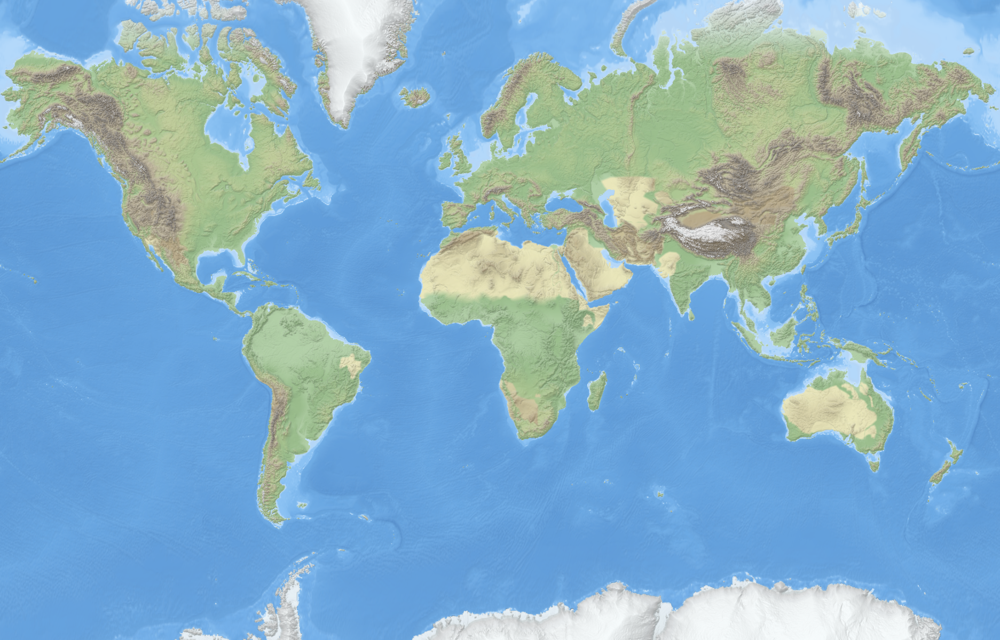

# Colorful Terrarium Server

This is a simple tiles server, build in Golang to consume Geo-Elevation Data (from Digital Elevation Modal, DEM) and serve a relief color style.

Example picture on how the relief style can look like.

